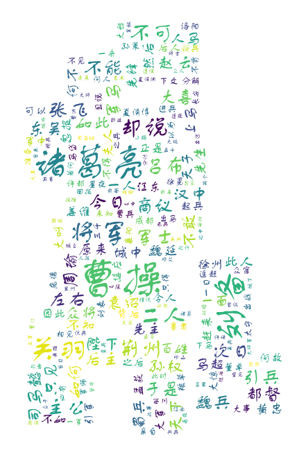

## 第6章 Python组合数据类型 课程实例代码

### 实例1
`6.1CalStatistics.py`：基本统计值计算

### 实例2
`6.2CalHamlet.py`：《哈姆雷特》 词频统计

### 实例3
`6.3CalThreeKingdoms.py`：《三国演义》词频统计

### 能力扩展
`ThreeKingdomsWordcloud.py`：《三国演义》词云制作

